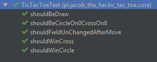
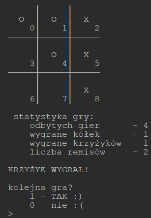
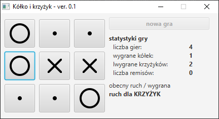

# Gra w kóło i krzyżyk

## zadanie dodatkowe z zajęć z TDD

Celem zadania jest stworzenie dopowiednich testów nie sama implementacja. Implementacja 
jest zadaniem dodatkowym.

Gra na przemia raz jedna raz druga osoba podaje pole

012\
345\
678

np game.move(2) ustawi krzyżyk w pozycji numer 2

\_ _ X\
\_ _ _\
\_ _ _

Zaczynamy od testów. 

## Testy do wykonania
* Testy wstawienia pola
* Testy poprawności ruchu ( czyli nie można w tą samą pozycję wstawić jednocześnie X O ) 
* Testy wygrania

## Wersja rozszerzona 1
* JavaFX i rysowanie z użyciem Canvas oraz ruchy myszy

## Wersja rozszerzona 2
* Bot z którym grasz. (TODO)

# Zrzuty ekranu

## testy

## wersja konsolowa

## wersja okienkowa
